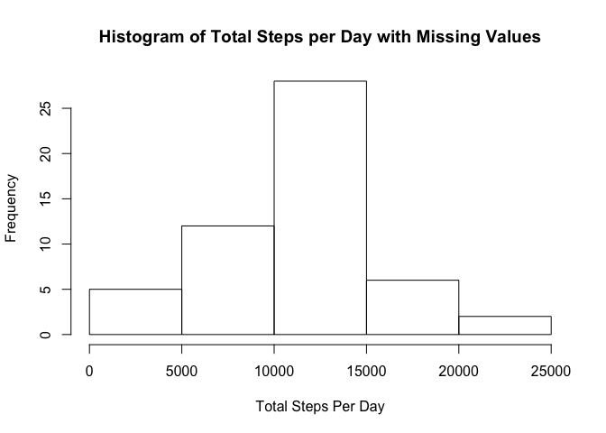
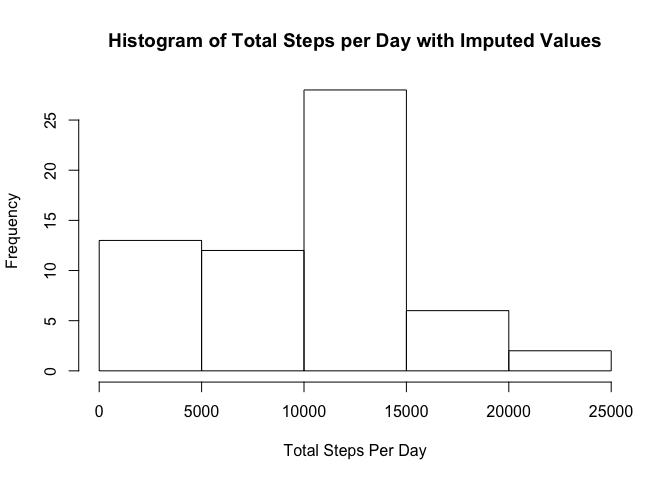
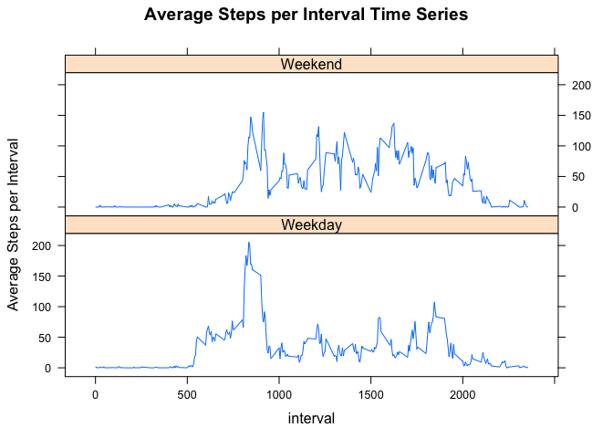

# Reproducible Research: Peer Assessment 1

## Loading and preprocessing the data


```r
download.file("https://d396qusza40orc.cloudfront.net/repdata%2Fdata%2Factivity.zip", 
              destfile = "activity.zip")
unzip("activity.zip")
activity <- read.csv("activity.csv")
```

## What is mean total number of steps taken per day?

```r
library(tidyverse)
```

```
## Loading tidyverse: ggplot2
## Loading tidyverse: tibble
## Loading tidyverse: tidyr
## Loading tidyverse: readr
## Loading tidyverse: purrr
## Loading tidyverse: dplyr
```

```
## Conflicts with tidy packages ----------------------------------------------
```

```
## filter(): dplyr, stats
## lag():    dplyr, stats
```

```r
StepsPerDay <- summarize(group_by(activity,date),
                         total = sum(steps),na.rm = TRUE)
hist(StepsPerDay$total, xlab = "Total Steps Per Day"
     , main = "Histogram of Total Steps per Day with Missing Values")
```

<!-- -->

```r
byInterval <- group_by(activity,interval)
StepsPerInterval <- summarize(byInterval,
                              avgSteps = mean(steps,na.rm = TRUE)
                              ,medianSteps = median(steps,na.rm = TRUE))
```

Mean total steps taken per day ignoring missing values: 10766.19  
Median total steps taken per day ignoring missing values: 10765  

## What is the average daily activity pattern?  
- Make a time series plot (i.e. 𝚝𝚢𝚙𝚎 = "𝚕") of the 5-minute interval (x-axis) and the average number of steps taken, averaged across all days (y-axis)  

```r
plot(avgSteps ~ interval, data = StepsPerInterval, type = "l"
     , main = "Average Steps per Interval Time Series", 
     ylab = "Average Steps per Interval")
```

<!-- -->

- Which 5-minute interval, on average across all the days in the dataset, contains the maximum number of steps? 
  08:35  

```r
higestInterval <- 
  StepsPerInterval[StepsPerInterval$avgSteps 
                   == max(StepsPerInterval$avgSteps),]$interval
```

## Imputing missing values

```r
#Count missing values
missing <- sum(is.na(activity$steps))
#fill missing values in the new dataset using median steps per interval across all days 
activity2 <- mutate(activity, steps = ifelse(is.na(steps),StepsPerInterval$medianSteps,steps))
```

- Make a histogram of the total number of steps taken each day  

```r
StepsPerDay2 <- summarize(group_by(activity2,date),
                         total = sum(steps),na.rm = TRUE)
hist(StepsPerDay2$total, xlab = "Total Steps Per Day"
     , main = "Histogram of Total Steps per Day with Imputed Values")
```

<!-- -->

- Calculate and report the total number of missing values in the dataset (i.e. the total number of rows with 𝙽𝙰s) : 2304  
- Mean total steps taken per day with imputed values: 9503.87  
- Median total steps taken per day with imputed values: 10395 

```r
meanSteps2 <- mean(StepsPerDay2$total,na.rm = TRUE)
medianSteps2 <- median(StepsPerDay2$total,na.rm = TRUE)
```

- What is the impact of imputing missing data on the estimates of the total daily number of steps?  
 The mean and median values after imputing the data are less than the mean and median values calculated with the missing data.  
 
## Are there differences in activity patterns between weekdays and weekends?


```r
library(lattice)
byweekday <- activity2 %>% mutate(weekday = factor(ifelse(weekdays(as.POSIXct(date)) %in% c("Saturday", "Sunday"), "Weekend","Weekday"))) %>% group_by(interval, weekday) %>% summarize(avgSteps = mean(steps,na.rm = TRUE))

xyplot(avgSteps ~ interval | weekday, data = byweekday, type = "l",main = "Average Steps per Interval Time Series", ylab = "Average Steps per Interval", layout = c(1,2))
```

<!-- -->

